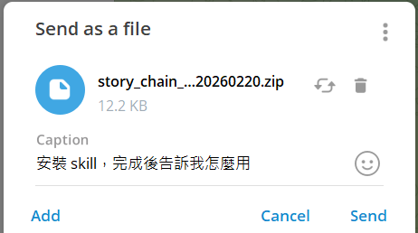
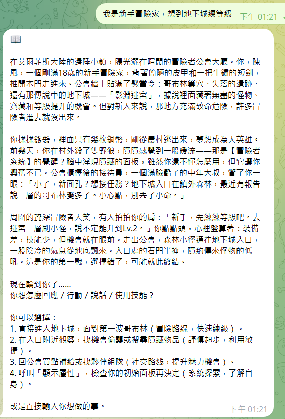
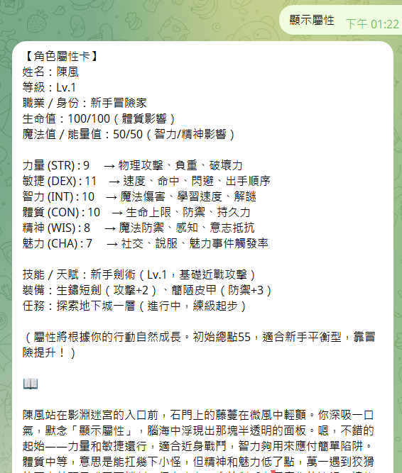
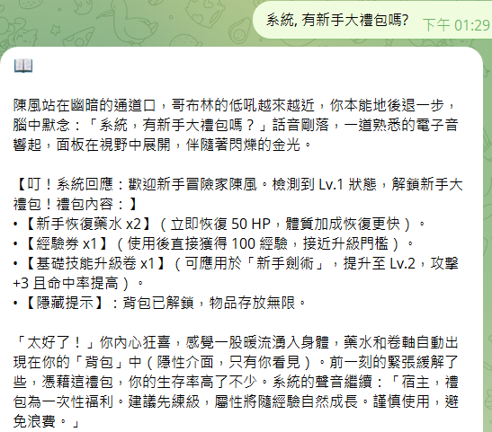

# Story Chain Multiverse + RPG — 多元宇宙互動故事接龍＋RPG 屬性系統

🔥 一個讓 AI、玩家與無限宇宙共創「爆款故事」的互動技能（Skill） — 玩得像桌遊、講得像影集、變化比你想像的還要多。

簡短一句話：用 AI 連成故事鏈，加入 RPG 屬性與隨機多元宇宙事件，打造每一回合都高潮迭起的敘事體驗。

---

**為什麼會上癮？**
- **即刻共創**：每個回合由玩家或 AI 接一段，故事不停長大，期待感像追劇。
- **屬性影響敘事**：角色的力量、魅力、智力會影響情節分支，讓每個決定都帶來真實後果。
- **多元宇宙隨機事件**：同一條故事會因宇宙隨機性出現完全不同的結果，重玩價值極高。
- **社群友好**：隊友、觀眾都能插入事件或投票，適合直播、社群活動與競賽。

---

**特色亮點**
- 支援多人接龍（玩家/觀眾/AI 混合）
- RPG 屬性系統：自訂屬性、裝備與技能影響敘事結果
- 可插入「宇宙事件卡」：隨機或指定事件打亂或升級情節
- 範本與提示庫（Prompts）內建，快速上手並能馬上錄製或直播

---

**快速上手（3 步）**
1. 將此 Skill 加入你的 AI agent (如: [OpenClaw](https://github.com/openclaw/openclaw) & [nanobot](https://github.com/HKUDS/nanobot) & [NextClaw](https://github.com/Peiiii/nextclaw) ...) 他/她/它 知道該怎麼做。。
2. 建立角色：分配屬性（力量/敏捷/智力/魅力 等）與一個簡短背景。
3. 開始接龍：由第一位玩家輸入起始句，AI 或下一位玩家接下一段。

範例起始提示（給玩家或 AI）：
> 在穿梭都市霓虹的夜裡，流浪劍士艾琳發現了一張通往平行都會的地鐵票……（請接 2-4 句）

系統會根據角色屬性與隨機宇宙事件回傳：行動成功/失敗、獲得物品、或遭遇新的分支選項。

---

**示例互動片段**
- 玩家 A：`艾琳用魅力試著說服守望者放她一馬。`
- 系統計算（魅力檢定）→ 成功：守望者被說服，交給艾琳一張神祕票根。
- 玩家 B：`艾琳決定在下一站下車探索票根上的符號。`

結果：票根的符號啟動了平行世界門，下一幕變成蒸汽龐克都市。

---

**爆款經營小撇步（讓作品更容易火）**
- 設計「易於理解但有深度」的起始場景，第一回合就要勾住觀眾。 
- 鼓勵觀眾投票決定關鍵分支（直播互動能快速擴散）。
- 將每條熱門故事整理成短片或圖文串，發到社群平台（TikTok/IG/X）。
- 舉辦週常主題賽、冠軍故事集結成合集供下載或展示。

---

**開發者 & 自訂**
- 可擴充的屬性系統與事件卡架構，方便新增職業、技能或宇宙特性。
- 範本目錄位於 `references/`，可直接複製或修改用於不同玩法（純劇情或成人向都有範例）。

---

**貢獻指南**
- 歡迎提交 issue 或 pull request：增加範本、優化屬性規則、或加入新的宇宙事件。
- 提交前請先閱讀 `SKILL.md` 與資料夾下的範例以保持一致性。

---

**授權**
- MIT（可自由使用、修改與商業化，請保留原作者聲明）。

